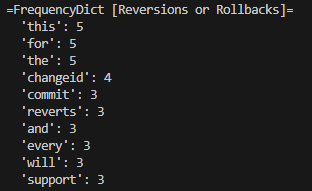
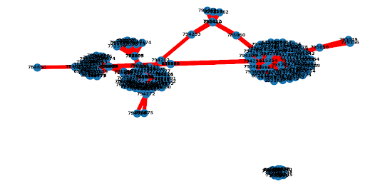
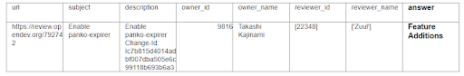
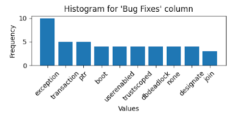
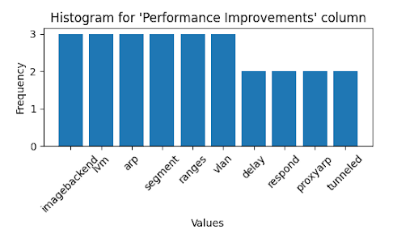
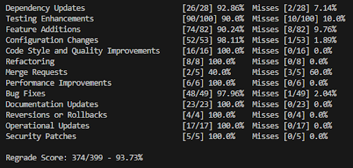

# DataSetInvestigator
Final project for SSW565

## Tags
Terminal, Data analytics

## Automating Categorization of OpenStack Check-ins
Automation yields many benefits to the software industry, and has become a cornerstone of Agile processes. Modern development practices involve automated unit testing, automated building/compilation and even auto generated documentation. In an effort to speed up development and get working products out the door, automation can vastly improve a team’s output and performance. OpenStack is a review board for various open source projects, and holds a constant stream of check-ins and bug reports. Automating the categorization of these check-ins based on their keywords and properties can help direct appropriate developers in the right direction. 

# Initial Investigation
Each check-in into OpenStack requires 7 properties: url, subject, description, owner_id, owner_name, reviewer_id, reviewer_name. In the initial investigation of the data sheet, which consisted of 500 randomized check-ins, it was determined that the ‘description’ column held the most potential for keywords and similarities to others. Since the datasheet held no other descriptors towards the types of check-ins these might be, development started by analyzing word frequencies compared to other reviews. Each check-in was parsed by the ‘description’ column and each word in the ‘description’ column was added to a frequency dictionary. After initial parsing, each check-in had their own frequency dictionary keeping a record of words used and their respective frequencies. 

These dictionaries were then compared to each other one-by-one to create groupings. Figure 2 shows these groupings, where the blue dots represent the check-in’s respective URL ID and the red lines indicate the strength of the correlation. A minimum correlation parameter was used to define the minimum percentage comparisons had to achieve to be considered similar.

 

# Improved Training Data
It was found that after the initial exploration of the data, there needed to be a way to define similar groupings. One way was to improve the training data by adding an 8th column to each check-in called an “answer” column. This column represented the category of the check-in defined by its own description. ChatGPT4 was selected as an impartial judge to determine categories for 400 out of the 500 sample check-ins. After date enhancements, it was found that there were 10 major categories for check-in types: Dependency Updates, Testing Enhancements, Feature Additions, Security Patches, Configuration Changes, Documentation Updates, Code Style and Quality Improvements, Refactoring, Merge Requests, Operational Updates, Performance Improvements, Bug Fixes, Reversions or Rollbacks.

 

Frequency dictionaries were then created for each category of check-in, resulting in a fully compiled list for all groupings. A common word list was added as a filter to ignore common words that appeared in most reviews. This contained words like “of”, “and”, “the”, “as”, etc. that are non-unique and crowd the frequency dictionaries. Furthermore, the categories were analyzed for fully unique words, which is defined by words that appear one or more times in a certain category of reviews, but in no other categories. Since software check-ins deal with unique technologies, unique words could be helpful to distinguish a certain category just by seeing a name of a testing platform or cloud service, for example. 

 

It was interesting to discover that from the dataset used, the word “exception” was only found in check-ins categorized as “Bug Fixes”. Even though in larger data sets the word would be bound to appear in another category. That being said, the frequency dictionary for the category would still capture the high usage of the word “exception” for Bug Fixes. Most other unique words represent some sort of acronym or short hand notation.

# Validation Testing
After sufficient data enhancements and test station improvements to the code base, backtesting was performed to determine the validity of the engine. Using the training data as a metric for success or failure, it was found that the engine had a 93.7% accuracy rating. 

 

Each correct answer and miss was scored in its own category and Figure 5 displays the total scores per category of check-in. The highest miss rating was against Merge Requests check-ins, with only a 40% success rate. This is because the sample data for Merge Requests consisted of only 5 data points, which made it difficult on the engine. Various other failures can be attributed to the brevity of some check-in descriptions and overall lack of data. For new check-ins that the engine has never seen before, the highest success rate is identifying Feature Additions. There were 82 of examples of Feature Additions in the test data and backtesting success rate was high at around 90%. The Feature Additions category also contains many unique words, which help the engine identify them easier.

# Improvements
While the engine developed in this project is simple, it serves as a good foundation for future investigations into automation of check-ins. The easiest improvement would be to increase the amount of data. Working with 500 samples was found to be problematic when dividing check-ins into categories, because some categories only had a handful of data points. Moreover, in an ideal case each category would contain the same amount of check-in data. Not only would more data improve results, but data with more information. Plenty of check-ins had short descriptions and provided minimal value to the engine’s frequency dictionaries. Next, as mentioned previously, incorrect spellings have a negative effect, and often trip up the unique word analysis of the data. It would be interesting to implement an auto-correction feature to negate the impact of incorrect spellings. As for the algorithm, there are further lines of study with the investigation of word connectivity rather than just frequency. How words are used in their context can provide a better method for clustering and identifying check-ins. Finally, another improvement would be to incorporate data from the other columns per data point. There are potential patterns in how each column is structured in a check-in. The engine code base was purposely made as generic as possible to accommodate different data and improvements to sub-components.

